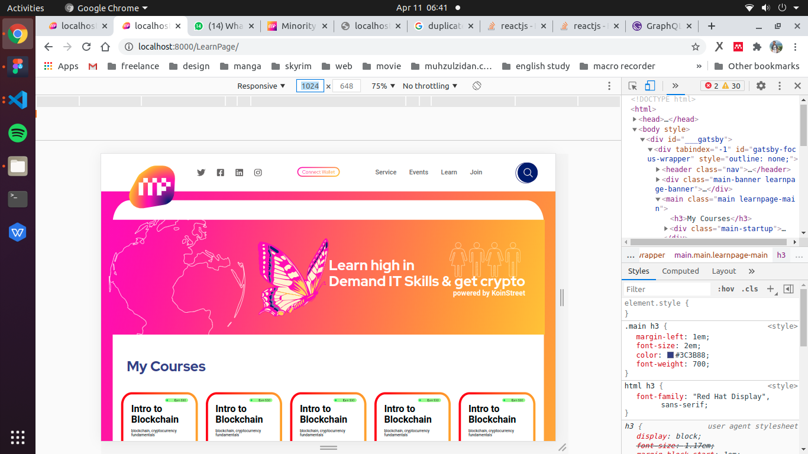

  

<h1 align="center">
  this website is built using gatsby
</h1>

**URL**

https://mpassociation.netlify.app/

**Pre Start**

first write `npm i` to install node modules  

npm that i use is : 14+

**Start** 
   
   start using : `gatsby develop` : http://localhost:8000

   or using `gatsby build` and then `gatsby serve` : http://localhost:9000

**LearnPage**

    http://localhost:8000/LearnPage/

    or

    http://localhost:9000/LearnPage/

**my test**

